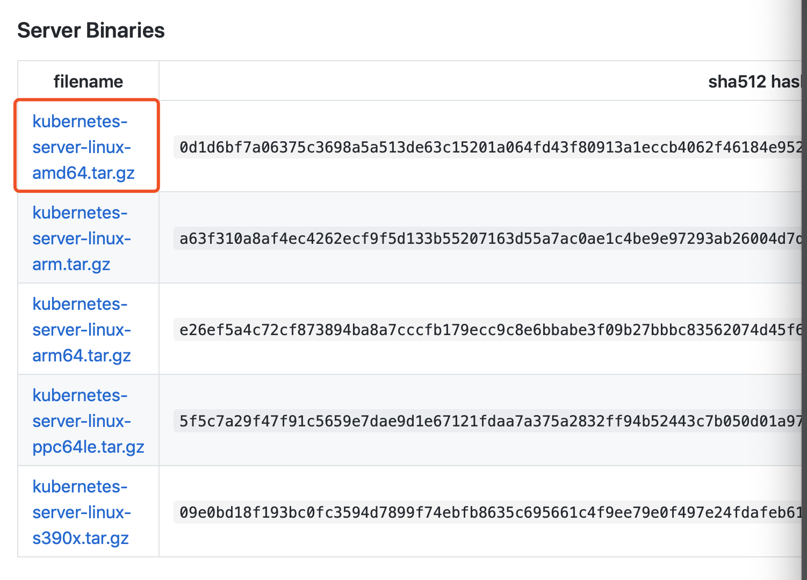
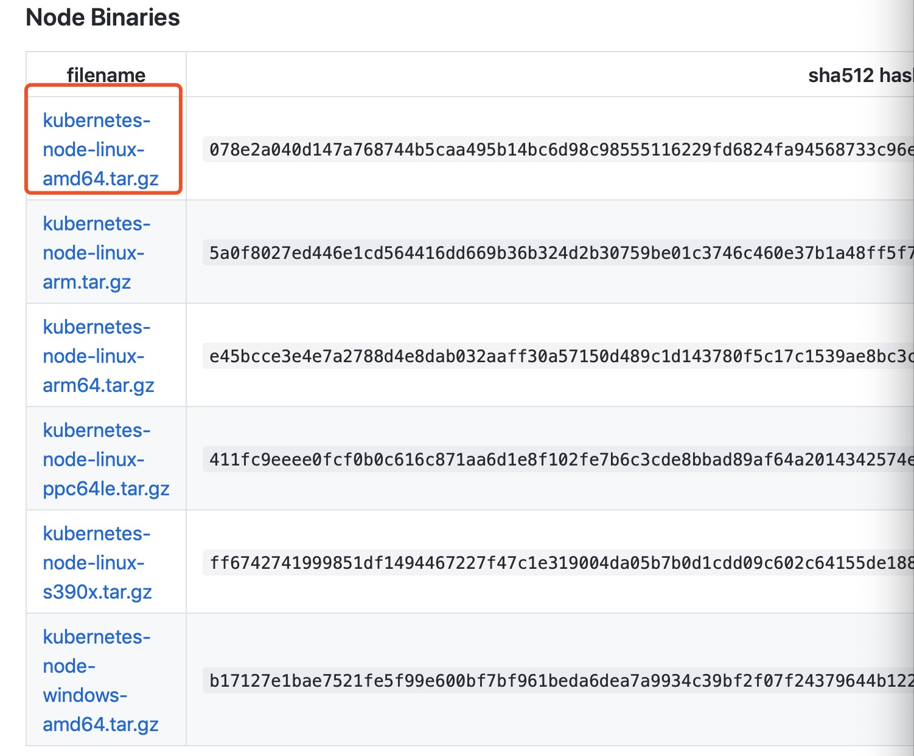

# k8s-Study k8s 学习以及实际部署总结留档
#### (一)搭建k8s集群（虚拟机模拟真实服务器）
   （1）搭建准备   
    准备三台服务器 or 虚拟机  
    192.168.0.105  master centos7    
    192.168.0.106  node1 centos7    
    192.168.0.107  node2 centos7  
    k8s 1.15 最新二进制下载  
    下载地址：https://github.com/kubernetes/kubernetes/blob/master/CHANGELOG-1.15.md#server-binaries  
    下载文件：kubernetes-server-linux-amd64.tar.gz      kubernetes-node-linux-amd64.tar.gz    
  
  
#### 
#### （二）所有服务器安装最新docker-ce  
官方安装方法：https://docs.docker.com/install/linux/docker-ce/centos/  
 
#### （三）所有服务器编辑 /etc/hosts
192.168.0.105  master  
192.168.0.106  node1  
192.168.0.107  node2  

#### （四）安装etcd 到master服务器
下载文件：https://github.com/etcd-io/etcd/releases etcd-v3.3.13-linux-amd64.tar 
解压命令 tar -xvf etcd-v3.3.13-linux-amd64.tar
跳转到目录 cd etcd-v3.3.13-linux-amd64  
拷贝文件 cp etcd /usr/local/sbin/  
拷贝文件 cp etcdctl /usr/local/sbin/  
